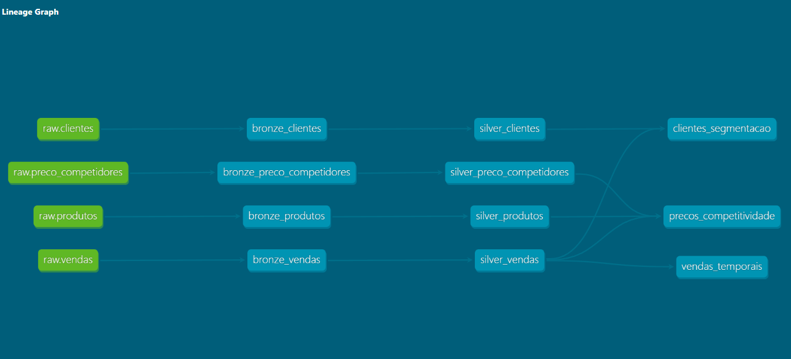

# 🛒 DBT | Jornada de Dados — Projeto Ecommerce

Projeto de pipeline de dados com **dbt (Data Build Tool)** seguindo a arquitetura **Medallion (Bronze → Silver → Gold)**, aplicado a um contexto de e-commerce com dados de clientes, produtos, preços e vendas.

---

## 📁 Estrutura do Projeto

```
ProjetoEcommerce/
└── Ecommerce/
    ├── analyses/
    ├── macros/
    ├── models/
    │   ├── bronze/
    │   ├── silver/
    │   └── gold/
    ├── seeds/
    ├── snapshots/
    ├── tests/
    └── dbt_project.yml
```

---

## 🏗️ Arquitetura Medallion

### 🟤 Bronze — Ingestão bruta
Camada de ingestão direta dos dados crus (`raw`), sem transformações.

| Model | Fonte |
|---|---|
| `bronze_clientes` | `raw.clientes` |
| `bronze_preco_competidores` | `raw.preco_competidores` |
| `bronze_produtos` | `raw.produtos` |
| `bronze_vendas` | `raw.vendas` |

---

### ⚪ Silver — Limpeza e padronização
Camada de limpeza, tipagem e padronização dos dados.

| Model | Origem |
|---|---|
| `silver_clientes` | `bronze_clientes` |
| `silver_preco_competidores` | `bronze_preco_competidores` |
| `silver_produtos` | `bronze_produtos` |
| `silver_vendas` | `bronze_vendas` |

---

### 🟡 Gold — Modelos analíticos
Camada de modelos prontos para consumo analítico e BI.

| Model | Descrição |
|---|---|
| `clientes_segmentacao` | Segmentação de clientes por comportamento de compra |
| `precos_competitividade` | Comparativo de preços com competidores |
| `vendas_temporais` | Análise temporal de vendas |

---

## 🔗 Lineage Graph



```
raw.clientes             → bronze_clientes             → silver_clientes             → clientes_segmentacao
raw.preco_competidores   → bronze_preco_competidores   → silver_preco_competidores   → precos_competitividade
raw.produtos             → bronze_produtos             → silver_produtos             → precos_competitividade
raw.vendas               → bronze_vendas               → silver_vendas               → vendas_temporais
```

---

## ⚙️ Como executar

```bash
# Instalar dependências
pip install dbt-postgres

# Rodar todos os models
dbt run

# Rodar apenas uma camada
dbt run --select bronze
dbt run --select silver
dbt run --select gold

# Rodar os testes
dbt test

# Gerar e visualizar documentação
dbt docs generate
dbt docs serve
```

---

## 🧪 Testes

Os testes estão definidos nos arquivos `.yml` de cada camada e cobrem:

- `not_null` — campos obrigatórios
- `unique` — chaves primárias
- `accepted_values` — domínios válidos

---

## 🛠️ Tecnologias

| Ferramenta | Uso |
|---|---|
| dbt | Transformação e orquestração dos models |
| PostgreSQL / Parquet | Banco de dados relacional |
| SQL | Lógica de transformação |
| VS Code | Desenvolvimento |

---

## 📚 Referências

- [Jornada de Dados](https://github.com/lvgalvao/data-engineering-roadmap)
- [dbt Docs](https://docs.getdbt.com)
